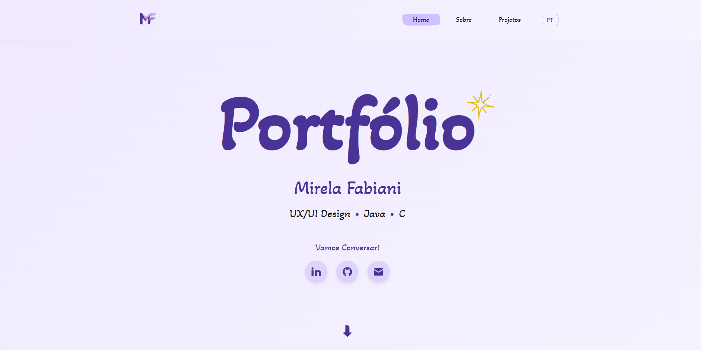
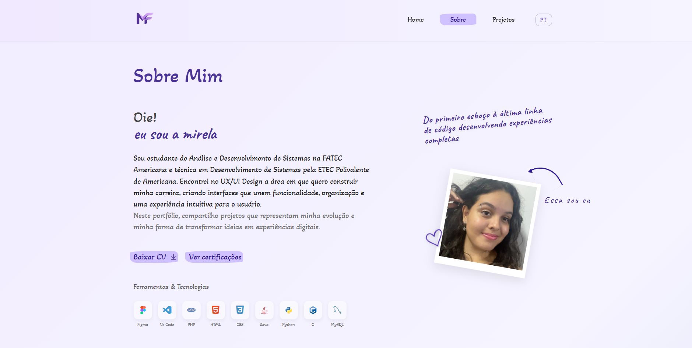
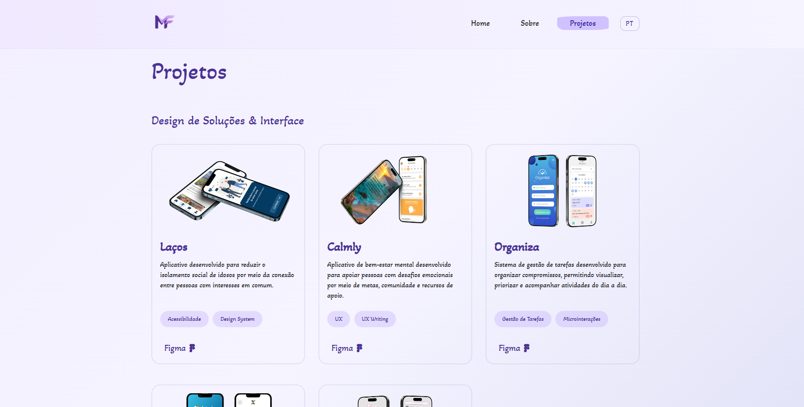

  🌐 <b>Languages:</b> <b>English 🇺🇸</b> • <a href="./README.pt-BR.md">Português 🇧🇷</a>

# 💼 Personal Portfolio

Personal portfolio developed to showcase my main projects, education, skills, and certifications.

 

## 🚀 Features

- Responsive layout
- Language switch
- Project showcase
- Resume download
- Certifications link
- Social media and contact links
- Smooth animations

 

## 🛠 Technologies

- HTML5
- CSS3
- JavaScript
- JSON

 

## 🌐 Live Website

**Portfolio:** https://mirela-apgf.github.io/Portfolio/

 

## 📸 Website Preview

  
  
  

 

## ▶ How to Run the Project

- Clone the repository
- Open the project folder
- Open the `index.html` file in your browser
